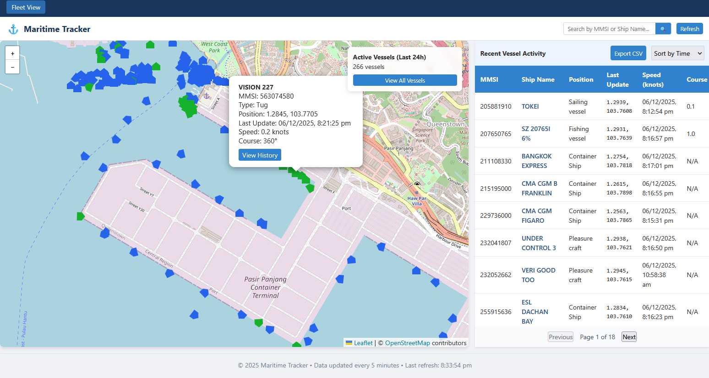
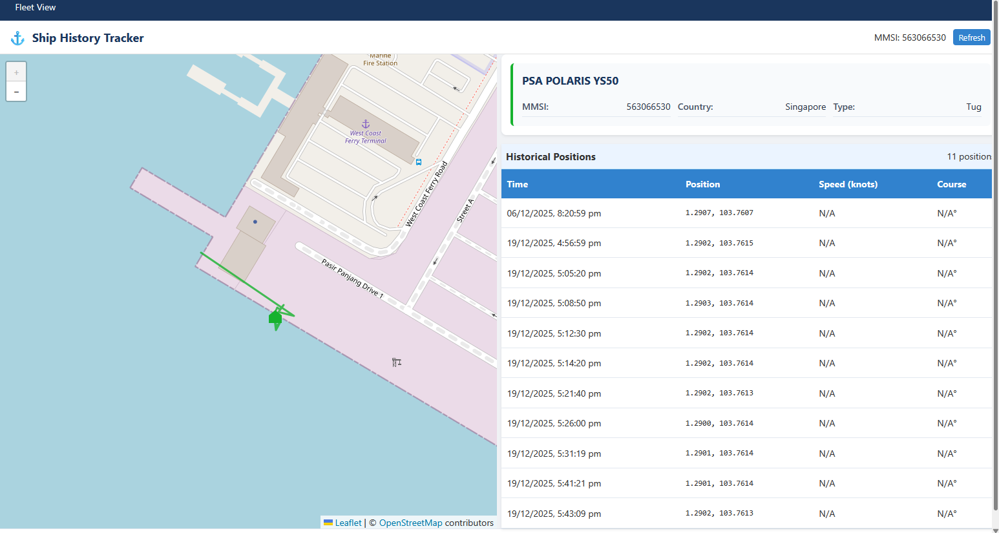
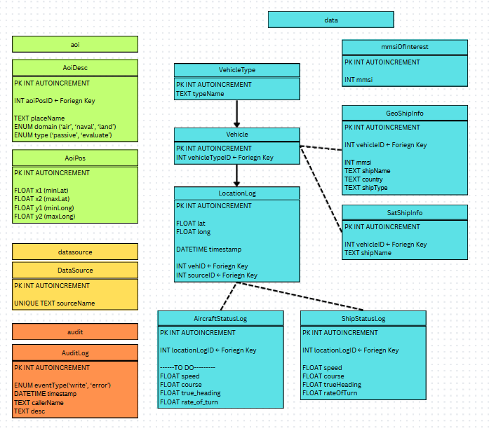

# Open Vehicle Map

## DISCLAIMER
UI/UX was designed and implemented with the help of LLM (Qwen).

The rest of the code (backend) was done by yours truly.

## Description
Designed to be a modular dashboard, where users can easily add info from multiple data sources, supplying location of various assets.

Users are able to add vehicle IDs of interest to specifically track them.

Users are able to add Area Of Interests (AOIs) to track geographical regions.





## How to use
`python -m main.py`

Then, go to `http://127.0.0.1:5000/` (yes, you host the site locally)

Add AOIs to the AOI db, the site will scan them regularly.

## To add sources
To add sources for maritime traffic, make them a subclass of `geoShipSource` and ensure they override the following abstract functions

```py
class geoShipSource(ABC):
    @staticmethod
    @abstractmethod
    def addToDatasource():
        pass

    @staticmethod
    @abstractmethod
    def scanAndSaveAreaToDB():
        pass

    @staticmethod
    @abstractmethod
    def scanAndSaveShipToDB():
        pass
```

Also add a function to run your scraper in `scraper.py`

## To edit more stuff

Below is the DB structure

