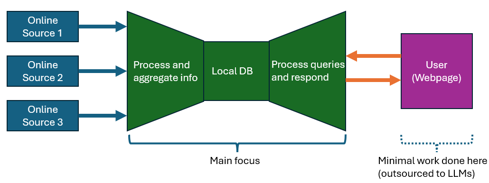
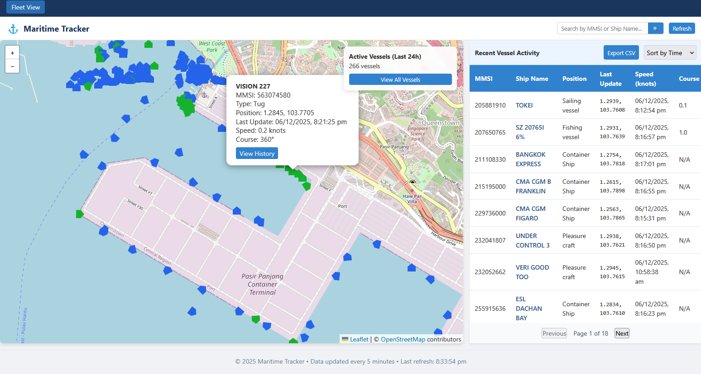
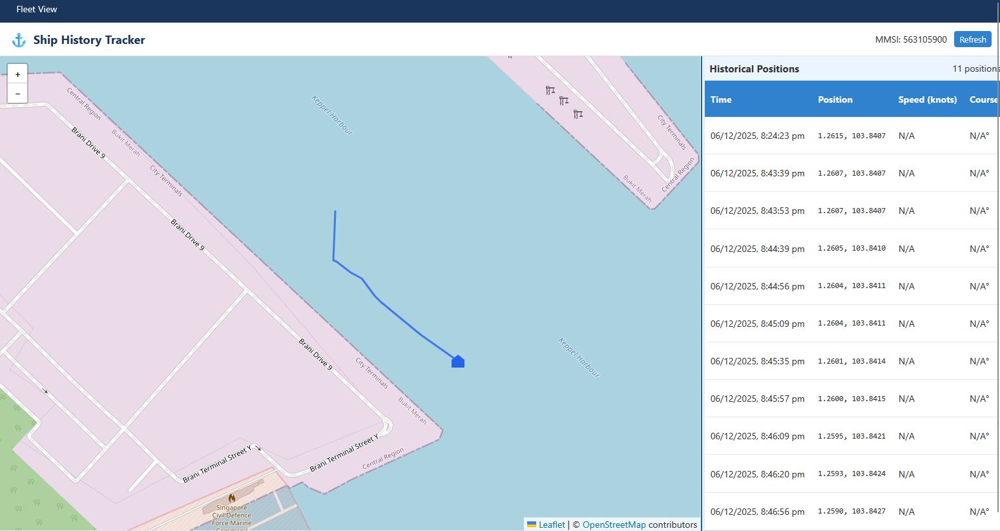
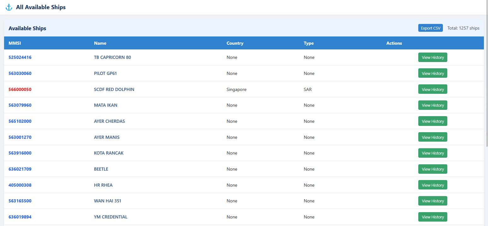
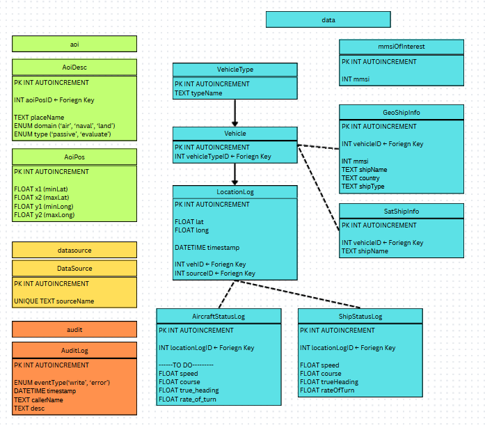
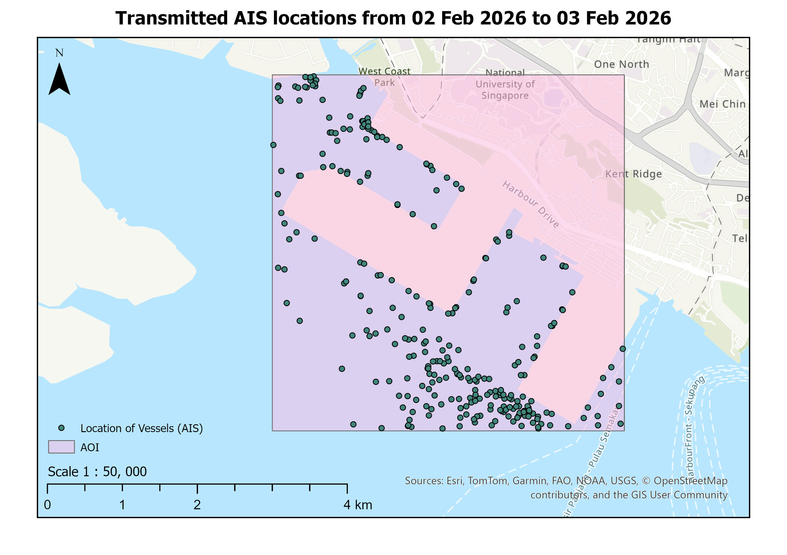

# Open Vehicle Map

## DISCLAIMER
UI/UX was designed and implemented with the help of LLM (Qwen).

The rest of the code (backend) was done by yours truly.

## Description
Designed to be a modular dashboard, where users can easily add info from **multiple data sources**, supplying location of various assets.



Currently, as a proof of concept, **3** + 1 data sources are being used.

- [VesselFinder](https://www.vesselfinder.com/)
- [AISFriends](https://www.aisfriends.com/)
- [MyShipTracking](https://www.myshiptracking.com/)
- Your own AIS Station! (As long as it provides NMEA messages)

Users are able to add vehicle IDs of interest to specifically track them.

Users are able to add Area Of Interests (AOIs) to track geographical regions.

Users are able to view all ships, and filter based on country, ship name, ship type, and MMSI







## How to use
`python -m main.py`

Then, go to `http://127.0.0.1:5000/` (yes, you host the site locally)

Add AOIs to the AOI db, the site will scan them regularly.

## To add sources
To add sources for maritime traffic, make them a subclass of `geoShipSource` and ensure they override the following abstract functions
You MUST change the `DATASOURCE_ID` and add it to `datasource.db`.

```py
class geoShipSource(ABC):    
    DATASOURCE_ID = -1

    @staticmethod
    @abstractmethod
    def addToDatasource():
        pass

    @staticmethod
    @abstractmethod
    def scanAndSaveAreaToDB():
        pass

    @staticmethod
    @abstractmethod
    def scanAndSaveShipToDB():
        pass
```

Also add a function to run your scraper in `scraper.py`

## Regarding ownself AIS stations

If you are able to receive AIS messages, you can use them as input for the system.

For the POC implementation, details are as follows.

- Receiver used was an RTL-SDR with a monopole antenna.

- To capture AIS data, [AIS Catcher](https://github.com/jvde-github/AIS-catcher) was used.

- Received data was streamed into a UDP server on port 10110

- To integrate the data into this system, a listener was set up on port 10110, and thereafter [pyais](https://pypi.org/project/pyais/) was used to convert NMEA messages into a Python dict with the relevant info.

- From there, data can be saved into the database as per usual.

## To edit more stuff

Below is the DB structure



## Additional Tools

To facilitate the analysis of data, there are currently 2 scripts to export data to a `.geojson` file.

[`TOOLS_aoi_db_to_geojson.py`](TOOLS_aoi_db_to_geojson.py): Exports the AOIs as polygons.

[`TOOLS_location_db_to_geojson.py`](TOOLS_location_db_to_geojson.py): Exports the LocationLogs of ships as polygons. By default, exports ships pinged in the last 24 hours.

To use these scripts, run `python .\TOOLS_aoi_db_to_geojson.py` or `python TOOLS_location_db_to_geojson.py` in the console.

Below is an example of the results when imported into a GIS application.


