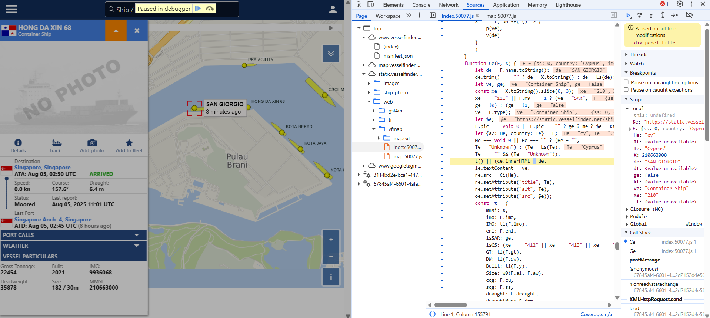

# TOC
- [TOC](#toc)
- [Finding API calls](#finding-api-calls)
- [/api/pub/mp2](#apipubmp2)
  - [Getting the code](#getting-the-code)
  - [Analyzing the code](#analyzing-the-code)
  - [Decoding ship "packet"](#decoding-ship-packet)


# Finding API calls
Upon opening the developer console, we are able to see that the website makes 2 requests whenever we shift the map.

```
https://www[dot]vesselfinder[dot]com/api/pub/mp2?bbox=62289350%2C749194%2C62307758%2C760850&zoom=15&mmsi=0&ref=88804.28172084698&filter=1
https://www[dot]vesselfinder[dot]com/api/pub/sfl?bbox=62289350%2C749194%2C62307758%2C760850&zoom=15&mmsi=0&ref=88804.28172084698&filter=1
```

Despite going to different endpoints, they share the same query parameters, namely

```
bbox    62289350,749194,62307758,760850
zoom    15
mmsi    0
ref     88804.28172084698
filter  1
```

From this, we can guess that:
- `bbox` refers to the bounding box of the area of interest (verified by shifting area of interest)
- `zoom` refers to the zoom level (verified by zooming in and out)
- `mmsi` refers to the selected ship's [Maritime Mobile Service Identity (MMSI)](https://en.wikipedia.org/wiki/Maritime_Mobile_Service_Identity)
- `filter` refers to the selected filter to filter types of ships (verified by changing filters on the website)

`ref` is still unknown.

# /api/pub/mp2
This returns a hex-encoded bunch of data. You can view it [here](./assets/mp2_output.hex).

```
43 00 08 50 00 00 00 07 0C 8E 76 58 44 40 22 1A 0F 5A 00 0B 86 80 03 B6 83 DD 01 05 45 4D 20 33 33 00 02 00 0A 00 03 00 03 00 32 E0 40 0C 8E 76 58 00 0B 92 6E 03 B6 9A C7 0A 2F 00 00 00 5D 01 0B 53 41 4E 20 47 49 4F 52 47 49 4F 68 91 E4 4F 00 86 00 24 00 07 00 17 00 57 E0 40 14 FB 29 DC 00 0B 92 A4 03 B6 A4 DF 03 0E 48 4F 4E 47 20 44 41 20 58 49 4E 20 36 38 00 A4 00 12 00 16 00 08 01 0B E0 40 1C 74 EB D8 00 0B 94 DC 03 B6 B3 63 03 09 43 53 43 4C 20 4D 41 52 53 00 92 00 DC 00 14 00 20 00 86 60 40 1F 4F 76 45 00 0B 95 80 03 B6 B9 B9 06 0A 41 42 48 49 4D 41 54 41 20 32 00 0A 00 10 00 02 00 03 80 00 E0 40 21 92 8F 08 00 0B 85 B1 03 B6 B3 EE 02 0C 4B 4F 54 41 20 53 45 4D 50 45 4E 41 00 B3 00 31 00 07 00 1E 01 39 60 41 1F 4C 68 DB 00 0B 94 FB 03 B6 BA 11 88 0A 41 42 48 49 4D 41 54 41 20 31 00 00 00 00 00 00 00 00 80 00 E0 40 21 90 CC 40 00 0B 8A CF 03 B6 AE CF 03 09 4B 4F 54 41 20 4A 41 59 41 00 96 00 2B 00 13 00 09 01 39 A0 40 21 8F D9 B6 00 0B 9A 8C 03 B6 A4 38 02 0B 50 53 41 20 41 47 49 4C 49 54 59 00 71 00 11 00 0E 00 08 00 58 E0 40 21 92 9F D4 00 0B 8D DA 03 B6 AB 36 02 0A 4B 4F 54 41 20 4E 45 4B 41 44 00 8F 00 25 00 0C 00 10 01 38
```

By viewing the decoded text, we are able to gain a bit of information.

```
C�P���ŽvXD@"Z�†€¶ƒÝEM 33��
���2à@ŽvX�’n¶šÇ
/���]SAN GIORGIOh‘äO�†�$���Wà@û)Ü�’¤¶¤ßHONG DA XIN 68�¤���à@tëØ�”ܶ³c	CSCL MARS�’�Ü�� �†`@OvE�•€¶¹¹
ABHIMATA 2�
���€�à@!’�…±¶³îKOTA SEMPENA�³�1��9`ALhÛ�”û¶ºˆ
ABHIMATA 1��������€�à@!Ì@�ŠÏ¶®Ï	KOTA JAYA�–�+��	9 @!Ù¶�šŒ¶¤8PSA AGILITY�q����Xà@!’ŸÔ�Ú¶«6
KOTA NEKAD��%��8
```

As you can see, some vessel names are included. Further tests at different areas of interests, zoom levels, filters, yield the same result.

At first we tried to spot patterns to try to guess how the data is encoded in the response. However, this was very luck-based.

Hence, we try to reverse engineer the code on the website.

## Getting the code

To trawl through the huge amount of files would require too much effort. As such, we used Google Chrome's developer tools to add breakpoint to subtree modifications, and applied it to a panel that displays ship info.



This reveals 2 important files, `index.50077.js` and `map.50077.js`.

Going through them, we manage to find an interesting function in `map.50077.js`, named `drawShipsOnMapBinary`.

```js
drawShipsOnMapBinary(t, e) {
    let i = this.map.getView(), n, r, o = [], a = [], l = [], h, c, u, d, f, g, _, m, p, y, x, E, S, R = !1, T = this.options.fleetMode ? this.options.fleetNames : !1, I = this.options.names && e >= 7 || e > bn;
    this.options.fleetMode && T && (I = !0);
    let v = I ? 1 : 0
        , b = e > yg
        , D = !1
        , O = t.byteLength
        , F = this.selectedMMSI
        , j = O >= 12 ? t.getInt8(2) : 0;
    if (j >= 8) {
        const M = t.getInt32(4)
            , L = this.options.mcb.p2
            , A = this.options.mcb.p3
            , X = this.options.mcb.p4;
        this.options.mcb = {
            p1: (M & 1) > 0,
            p2: (M & 2) > 0,
            p3: (M & 4) > 0,
            p4: (M & 8) > 0,
            emp1: !1,
            emp1z: 0,
            emp2: !1
        },
            L === !1 && this.options.mcb.p2 === !0 && mworker.postMessage({
                cmd: "pjson"
            });
        let G = !1;
        A !== this.options.mcb.p3 && (this.reconfigP3(this.options.mcb.p3),
            G = !0);
        let q = vt;
        X !== this.options.mcb.p4 && (q = this.options.mcb.p4 ? 6 : vt,
            G = !0),
            G && setTimeout(() => this.attachVTE(q)),
            F = t.getInt32(8)
    }
    let w = 4 + j;
    for (; w < O;) {
        E = 0;
        let M = t.getInt16(w), L = (M & 240) >> 4, A = (M & 16128) >> 8, X = M & 49152, G;
        if (e > 6)
            switch (X) {
                case 49152:
                    G = 2;
                    break;
                case 32768:
                    G = 0;
                    break;
                default:
                    G = 1;
                    break
            }
        else
            G = 1;

            w += 2,
            u = t.getInt32(w),
            D = u === F,

            w += 4,
            f = t.getInt32(w) / An,

            w += 4,
            d = t.getInt32(w) / An,

            w += 4,
            y = new Ft(tt([d, f], nt, Q)),
            D && (h = t.getInt16(w) / 10,
                w += 2,
                c = t.getInt16(w) / 10,
                w += 2,
                w += 2),
            S = t.getInt8(w),
            w += 1;

        let q = t.getInt8(w);
        if (w += 1,
            w + q > O)
            break;
        x = _g(t, w, q),
            w += q,
            x == "" && (x = u.toString()),
            D && (E = t.getInt32(w),
                w += 4);
                
        let C = 0;
        if (b && (g = t.getInt16(w),
            w += 2,
            _ = t.getInt16(w),
            w += 2,
            m = t.getInt16(w),
            w += 2,
            p = t.getInt16(w),
            w += 2,
            C = t.getInt16(w),
            w += 2,
            g + _ > 0 && m + p > 0 && g + _ <= 500 && m < 63 && p < 63)) {
            let dt;
            C >= 0 && C <= 360 ? dt = C : A < 32 ? dt = Math.floor(A * 11.25) : dt = -1,
                dt > -1 && a.push(vg(f, d, g, _, m, p, dt, L))
        }
        let xt = M & 1
            , V = (M & 2) !== 0
            , U = 0;
        V && (b ? U = C : (U = t.getInt16(w),
            w += 2));
        const At = u === this.selectedMMSI;
        v != 0 ? (r = new J({
            geometry: y,
            name: x,
            old: (M & 4) > 0,
            tstamp: E,
            td: S,
            tf: this.options.timeFormat,
            z: v,
            selected: At || u === this.oldHoverMMSI
        }),
            l.push(r)) : r = null,
            n = new J({
                geometry: y,
                name: x,
                mmsi: u,
                cog: h,
                sog: c,
                tstamp: E,
                selected: At,
                sar: V,
                old: xt,
                sar_alt: U,
                color: L,
                iconNumber: A,
                size: G,
                z: v,
                td: S,
                nf: r,
                sat: !1,
                mty: 1
            }),
            o.push(n),
            u === this.trackMMSI && this.trackIsDrawn && this.addCurrentTrackPoint(y.getCoordinates(), h, c, E),
            At && (this.selectedShipMarker = n,
                R = !0)
    }
    if (this.markers.clear(!0),
        this.shipNames.clear(!0),
        this.shapes.clear(!0),
        this.extraMarkers.clear(!0),
        O === 4 && this.options.filter === 0 && this.clearPreflight(),
        this.markers.addFeatures(o),
        this.shipNames.addFeatures(l),
        this.shapes.addFeatures(a),
        R) {
        this.selectedShipMarker.set("subtitle", Xs(this.selectedShipMarker, this.options.timeFormat)),
            this.selectionMarker.setGeometry(this.selectedShipMarker.getGeometry()),
            this.extraMarkers.addFeature(this.selectedShipMarker),
            this.markers.addFeature(this.selectionMarker),
            this.selectionMarkerAdded = !0;
        let M = i.calculateExtent(this.map.getSize())
            , L = this.selectedShipMarker.getGeometry().getCoordinates()
            , A = ue(M, L);
        st("ship-in-view", {
            visible: A,
            zoom: e
        }),
            this.trackIsDrawn && this.trackZoom !== e && (this.trackZoom = e,
                this.simplifyTrack(this.trackZoom))
    } else
        this.selectionMarkerAdded = !1;
    e < 10 && this.options.as && this.ASSource.clear()
```

## Analyzing the code

The interesting part of the code is here:

```js
let M = t.getInt16(w), X = M & 49152, G;
if (e > 6)
    switch (X) {
    case 49152:
        G = 2;
        break;
    case 32768:
        G = 0;
        break;
    default:
        G = 1;
        break
    }
else
G = 1;

w += 2,
u = t.getInt32(w),
D = u === F,

w += 4,
f = t.getInt32(w) / An,

w += 4,
d = t.getInt32(w) / An,

w += 4,
y = new Ft(tt([d, f], nt, Q)),
D && (h = t.getInt16(w) / 10,
    w += 2,
    c = t.getInt16(w) / 10,
    w += 2,
    w += 2),
S = t.getInt8(w),
w += 1;
```

Basically, it reads the values and saves them to variables. Important to note is how many bytes are read at a time, and any operations performed on it before being saved.

This saved info is then later edited into the HTML, so it has to be important.

Long story short, the response that we get has a 12-byte header, followed by "packets" of ships.

## Decoding ship "packet"

An example of a ship "packet" is as such:

```
44 40 22 1a 0f 5a 00 0b 86 80 03 b6 83 dd 01 05 45 4d 20 33 33
```

The first 2 bytes are not very important, though it can be used to filter the vessel size, icon, display color, and whether it is used for SAR.

The relevant code is below.

```js
let M = t.getInt16(w), L = (M & 240) >> 4, A = (M & 16128) >> 8, X = M & 49152, G;
if (e > 6)
switch (X) {
case 49152:
    G = 2;
    break;
case 32768:
    G = 0;
    break;
default:
    G = 1;
    break
}
const V = (M & 2) !== 0
```

`G` will give the size, `A` the icon number, `L` the display color, `V` whether it is for SAR.

<br/>


The next 4 bytes is the ship's MMSI: `22 1a 0f 5a` converted to decimal gives `572133210`, which is a valid MMSI for the ship `EM 33`.

<br/>


Following that, the next 8 bytes represent the latitude (4 bytes) and longitude (4 bytes) of the ship. However, some processing has to be done.

As seen in the code above, it is divided by a variable `An`. This works out to be `600000`.

Trying it out, we have:

Latitude  -> `00 0b 86 80` converted to decimal gives `755328`  , divided by 600000 gives `1.25888`.

Longitude -> `03 b6 83 dd` converted to decimal gives `62292957`, divided by 600000 gives `103.821595`.

Sure enough, when we input the coordinates `1.25888, 103.821595`, we are brought to a place near Pulau Brani, which is our tested area of interest.

<br/>

The next byte is not important.

<br/>

After that, the byte will tell us the length of the ship's name. In this case, it tells us that it is 5 characters long.

<br/>

The next 5 characters will thus be the ship name.

Sure enough, `45 4d 20 33 33` decodes to `EM 33`, the ship with the MMSI we were able to find.

<br/>

In some cases, there will be extra bytes before the start of the next ship packet. This is due to the zoom level being too high. Zoom levels above 13 will trigger these extra bytes.

<br/>

In summary,

```
44 40 22 1a 0f 5a 00 0b 86 80 03 b6 83 dd 01 05 45 4d 20 33 33
|xxxx|---MMSI----|-latitude and longitude|xx|len|-----name----|---extra 10 bytes if zoom level above 13---|
```
